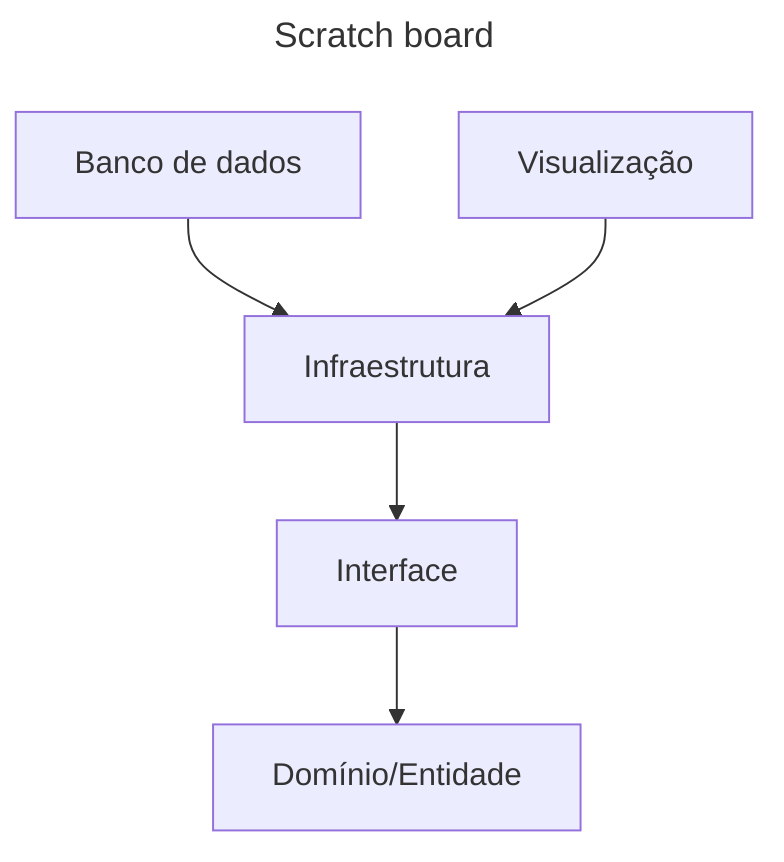

```mermaid
---
title: Scratch board
---
flowchart TD
    db["Banco de dados"]
    view["Visualização"]
    infra["Infraestrutura"]
    adap["Interface"]
    dominio["Domínio/Entidade"]
    db --> infra
    view --> infra
    infra --> adap
    adap --> dominio
```